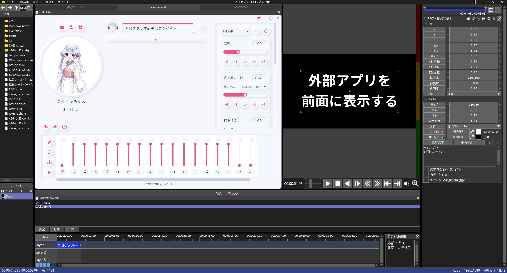
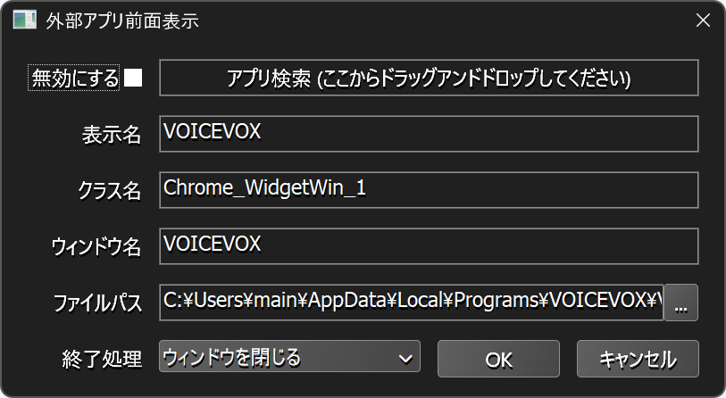

# 🐍AviUtl2 外部アプリ前面表示プラグイン

* aviutl2の汎用プラグインです。
* aviutl2ウィンドウより前面に外部アプリウィンドウを表示するようにします。

## 🚀インストール

* `プラグインフォルダ`に以下のファイルを入れてください。
	* `al2` ✏️フォルダ
		* `al2_appride.aux2` ✏️入力プラグインファイル

## 🔥アンインストール

* `プラグインフォルダ`から以下のファイルを削除してください。
	* `al2` ✏️フォルダ
		* `al2_appride.aux2` ✏️このファイルを削除
		* `al2_appride` ✏️このフォルダを削除

## 💡使い方

1. `外部アプリ前面表示`ウィンドウを表示します。

> [!IMPORTANT]
> * 設定の変更はaviutl2を再起動したときに反映されます。

### 🏷️外部アプリウィンドウを追加する

1. `編集`ボタンを押します。
1. `外部アプリの設定`ダイアログが表示されます。
	* [`🔧外部アプリの設定ダイアログ`](#外部アプリの設定ダイアログ)を参照してください。

### 🏷️外部アプリウィンドウを編集する

1. リストボックス内の該当する外部アプリの項目を選択します。
1. `編集`ボタンを押します。
1. `外部アプリの設定`ダイアログが表示されます。
1. `🏷️外部アプリウィンドウを追加する`と同じ様に設定します。

### 🏷️外部アプリウィンドウを削除する

1. リストボックス内の該当する外部アプリの項目を選択します。
1. `削除`ボタンを押します。
1. 確認メッセージボックスが表示されるので、`OK`ボタンを押します。

### 🏷️設定を初期化する

1. aviutl2を起動していない状態で`プラグインフォルダ`内の以下のファイルを削除してください。
	* `al2` ✏️フォルダ
		* `al2_appride` ✏️フォルダ
			* `config` ✏️フォルダ
				* `al2_appride.json` ✏️このファイルを削除

### 🏷️外部アプリを選択する

1. `外部アプリの設定`ダイアログを表示します。
1. 外部アプリを起動します。
1. 外部アプリウィンドウがaviutl2ウィンドウのすぐ後ろにくるように開いておきます。
1. `アプリ検索`と書いてある枠を左クリックしたまま維持します。
	1. aviutl2ウィンドウが一時的に非表示になります。
	1. 左クリックしたまま外部アプリウィンドウ上までマウスカーソルを移動します。
	1. `クラス名`、`ウィンドウ名`、`ファイルパス`が自動的に入力されます。
1. 左クリックを解除します。
	1. 再びaviutl2ウィンドウが表示されます。
1. `ウィンドウ名`にドキュメント名などが付与されている場合は、その部分だけを削除します。
	* (アプリ名だけ、のようなアプリ固有の部分文字列になるように調整します)
1. `表示名`には他のプラグインウィンドウと重複しないようなユニークな文字列を指定します。

## 🔧外部アプリの設定ダイアログ

* `無効にする` ✏️チェックを入れると、この外部アプリ表示が無効になります。
	* 削除ではなく、一時的に無効にしたい場合に使用してください。
* `アプリ検索` ✏️外部アプリを選択します。
	* [`🏷️外部アプリを選択する`](#外部アプリを選択する)を参照してください。
* `表示名` ✏️外部アプリウィンドウに付ける名前を指定します。
* `クラス名` ✏️外部アプリを特定するためのクラス名を指定します。
* `ウィンドウ名` ✏️外部アプリを特定するためのウィンドウ名を指定します。
* `ファイルパス` ✏️外部アプリを起動するためのファイルパスを指定します。
* `終了処理` ✏️aviutl2を終了したときの外部アプリの終了モードを指定します。
	* `ウィンドウを閉じる` ✏️外部アプリのウィンドウを閉じます。
		* 安全な閉じ方ですが、ゴースト(見えない)プロセスが残ってしまう不具合が発生する場合があります。
		* その場合はタスクマネージャからゴーストプロセスを閉じる必要があります。
	* `プロセスを強制終了する` ✏️外部アプリのプロセスを強制終了します。
		* aviutl2と連動して確実に終了させることができますが、編集中のデータが失われる可能性があります。

## 🔖更新履歴

* 🔖r1 2026年03月07日
	* 🎉初版
